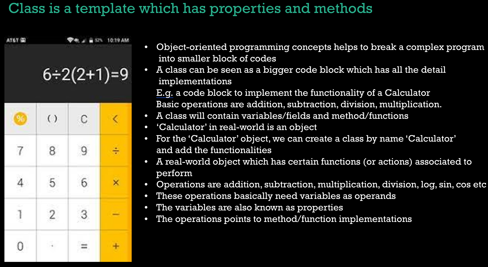

### Flow of java code. From syntax to bytecode

1. You edit/create java apps in a editor. That is stored on disk. This is phase one of ur code. This is the human understandable phase of code
2. Now the program is compiled into java bytecode, and stored into disk. This is compiled java code, ready to be executed by JVM. This is phase 2
3. When you ask the JVM to execute the bytecode, the .class file is loaded into memory and passed onto bytecode verifier
4. Bytecode verifier checks ur code, and look if ur code violates any Java's Security restrictions. If not, the code is passed on to JVM to execute
5. Here, JVM reads the bytecode and translates them into machine code, so that the hardware can execute and return an output. The values/variables are stored in memory

### Class and objects, heart of object orientied programming

I was lazy to summarise, the PPT was good, so I totally did not copy paste. Believe me :)

### Class

Structure of class

class ClassName {

// fields(variables) - Used to store data

// methods - Perform operation

}
